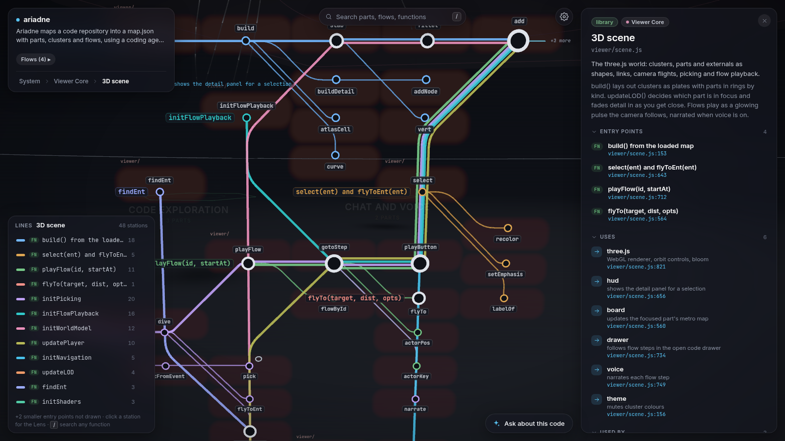

# Ariadne

**A thread through the labyrinth of your codebase.**

AI writes code faster than anyone can read it. Ariadne turns any repository into a calm, explorable 3D map that explains itself in plain English: what the system does, how its parts talk, and how a request actually flows through the code, down to the exact line.


[Watch in HD (MP4)](docs/demo.mp4)

Demo: the [OpenTelemetry Demo](https://github.com/open-telemetry/opentelemetry-demo) (Apache-2.0), mapped with `--model sonnet` in about a minute.

## What you get

- **Semantic zoom.** Far away: the domains of your system and the outside services they use (databases, queues, clouds, SaaS). Closer: each service and its one-line purpose. Closer still: its entry points, flows and code.
- **Flows you can play.** Real request paths ("a customer places an order") play step by step across services, with a caption per step and optional voice narration.
- **Metro map of the code.** Inside a service, every entry point (HTTP route, consumer, cron, CLI) is a metro line through the functions it calls, in order. Shared helpers are interchanges; badges show where code touches a database, queue or API.
- **Lens.** Click any function: who calls it, what it calls, the types it uses and what it touches, grouped by file. Click through to keep exploring.
- **Real code, always one click away.** A full code browser (file tree, syntax highlighting, "find uses", ⌘P) that stays linked to the map: select code and see where it lives.
- **Ask it.** A small side chat answers questions from the map and the code, and can drive the view ("show me how checkout works" flies there and plays the flow).
- **Grounded.** Every step and claim points to a `file:line`, and every reference is checked by a script. Anything that doesn't verify is marked ⚠.



## Quick start

Requirements: Python 3.10+, git, a modern browser, and one coding-agent CLI: [Claude Code](https://docs.claude.com/en/docs/claude-code) (`claude`), [pi](https://github.com/earendil-works/pi), [opencode](https://opencode.ai) or [codex](https://github.com/openai/codex). The function-level views also need [`uvx`](https://docs.astral.sh/uv/) (Ariadne runs [code-review-graph](https://pypi.org/project/code-review-graph/) through it).

```sh
git clone https://github.com/blackhat-7/ariadne && cd ariadne

# 1. Map a repo. You choose the agent and model; Ariadne shows a usage estimate first.
python3 ariadne.py build ~/code/my-repo -o my-repo.map.json

# 2. Explore it
python3 ariadne.py serve my-repo.map.json --repo ~/code/my-repo
# open http://127.0.0.1:7777
```

Non-interactive: `--agent claude --model sonnet --yes`. Add `--base main` to light up what changed since a revision.

## Choosing a model

Mapping reads a lot of code, so **Ariadne never picks a model for you**: `build` shows a usage estimate and asks for the agent and model, and the chat asks before its first answer. Any model your agent CLI supports works. Larger models trace flows more thoroughly; smaller ones are faster and use less. Either way, every `file:line` reference is checked, so a weaker model can't quietly invent code locations.

## What uses a model, and what doesn't

| Piece | How it's made |
|---|---|
| Summaries, flows, domains | Your chosen agent CLI, once, at `build` |
| Functions, types, calls, metro lines | Static analysis (tree-sitter via code-review-graph). No model, deterministic, fast |
| `file:line` verification | A script |
| Chat | The agent/model you pick in Settings ⚙ |
| Voice | Your browser's built-in speech |

## Privacy

Everything runs on your machine. Ariadne only talks to the agent CLI you choose, which sends what it reads to its own provider. Generated maps contain excerpts of your code: keep them private (`.gitignore` already ignores `*.map.json`, `map.json` and `*.parts/`).

`serve` binds to `127.0.0.1` by default. `--host 0.0.0.0` exposes the map, **your source code** and the chat (on your agent account) to your network; prefer a private network such as Tailscale.

## Controls

Scroll or pinch to zoom · drag to rotate · right-drag or two-finger scroll to move · double-click to dive in · `Esc` to step out · `/` search · `⌘P` open file · Space to play/pause a flow.

Deep links run view actions on load: `http://127.0.0.1:7777/#act=[{"type":"focus","id":"orders-api"}]` (URL-encode the JSON).

## How it works

1. **Slice** the repo into parts (one per service/package; nested projects count toward the nearest one).
2. **Map** the slices in parallel with your agent CLI, read-only, following [SCHEMA.md](SCHEMA.md): summary, entry points, outside systems, and real flows with `file:line` references.
3. **Assemble**: verify every reference, group parts into domains, find cross-service flows, classify outside systems ([SPEC.md](SPEC.md)).
4. **Serve**: the viewer, a read-only code API confined to the repo, the code graph for function-level views, and the chat.

The viewer is plain ES modules and CSS with three.js from a CDN: no build step. Design notes: [DESIGN.md](DESIGN.md). Metro data contract: [METRO.md](METRO.md).

## Limitations

- No incremental updates yet: re-run `build` after big changes.
- Function-level call links come from static analysis plus name matching; dynamic dispatch can be missed or, rarely, mis-linked.
- Tested mostly on Go, Python, TypeScript and C++ codebases.

## License

MIT
