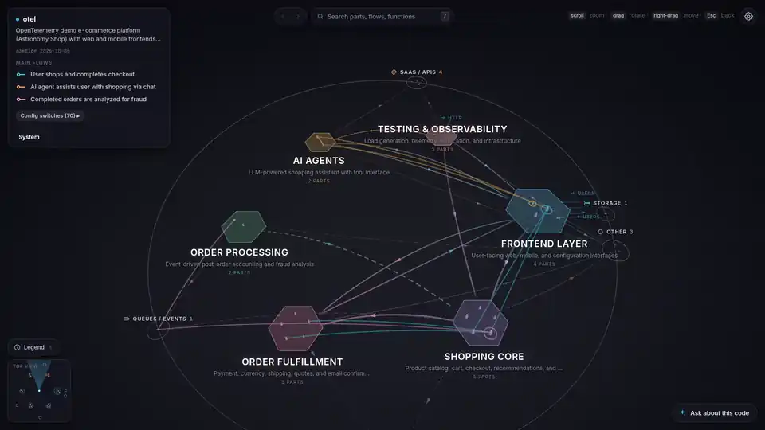

# Ariadne

Ariadne turns a codebase into a 3D map you can explore: its services, how they talk to each other, the requests that flow through them, and the code behind every step.



<sub>The [OpenTelemetry Demo](https://github.com/open-telemetry/opentelemetry-demo), mapped in about a minute. [HD video](docs/demo.mp4)</sub>

## Install

You need [uv](https://docs.astral.sh/uv/getting-started/installation/) and one coding agent CLI: [Claude Code](https://docs.claude.com/en/docs/claude-code), [pi](https://github.com/earendil-works/pi), [opencode](https://opencode.ai) or [codex](https://github.com/openai/codex).

```sh
uv tool install git+https://github.com/blackhat-7/ariadne
```

Update later with `uv tool upgrade ariadne`.

## Use

```sh
cd ~/code/your-repo
ariadne
```

The first run maps the repo: it shows a usage estimate and asks which agent and model to use. Then it opens the map in your browser. Later runs open it straight away.

| Command | Does |
|---|---|
| `ariadne [folder]` | Map if needed, then open |
| `ariadne build [folder]` | Map again (after big changes) |
| `ariadne serve [folder]` | Open without mapping |

Skip the questions with `--agent claude --model sonnet --yes`.

## In the app

- Zoom in to go from domains to services to functions to code.
- Press ▶ on a flow to play a request step by step.
- Click a function to see its callers and callees.
- Ask the chat a question; it answers from the code and moves the view.
- ⚙ Settings: chat model, voice narration, and the Glass or Voxel look.

Pinch or scroll to zoom, drag to rotate, `/` to search, `Esc` to go back.

## Notes

- Everything runs locally. Your agent CLI sends the code it reads to its provider.
- Maps are saved in `~/.local/share/ariadne/maps/`, not in your repo. They contain snippets of your code.
- `serve --host 0.0.0.0` makes the map and your code reachable from your network.
- Every `file:line` in a map is checked; anything that doesn't match is marked ⚠.

## License

MIT
